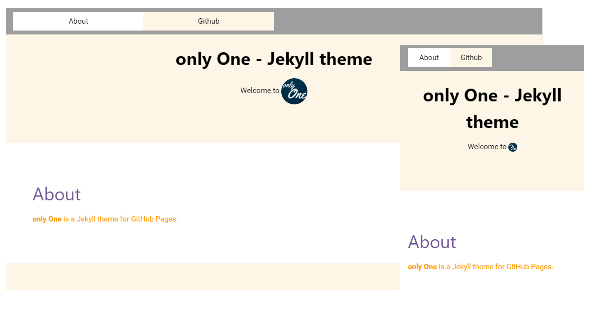

# **only One** Jekyll theme

**only-One** is a Jekyll theme for GitHub Pages.

## Features

* Compatible with GitHub Pages.
* Support for Jekyll's built-in Sass/SCSS preprocessor.
* Several responsive layout options.
* [Google Analytics](https://www.google.com/analytics/) support.

## Installation

There are three ways to install: as a [gem-based theme](https://jekyllrb.com/docs/themes/#understanding-gem-based-themes), as a [remote theme](https://blog.github.com/2017-11-29-use-any-theme-with-github-pages/) (GitHub Pages compatible), or forking/directly copying all of the theme files into your project.

## Contributing

Interested in contributing to **only-One**? We'd love your help. **only-One** is an open source project, built one contribution at a time by users like you. See [the CONTRIBUTING file](docs/CONTRIBUTING.md) for instructions on how to contribute.

### Previewing the theme locally

If you'd like to preview the theme locally (for example, in the process of proposing a change):

1. Clone down the theme's repository (`git clone https://github.com/AREA44/only-One`)
2. `cd` into the theme's directory
3. Run `bundle exec jekyll serve` to start the preview server
4. Visit [`localhost:4000/only-One/`](http://localhost:4000/only-One) in your browser to preview the theme

## License
[MIT](LICENSE.md)